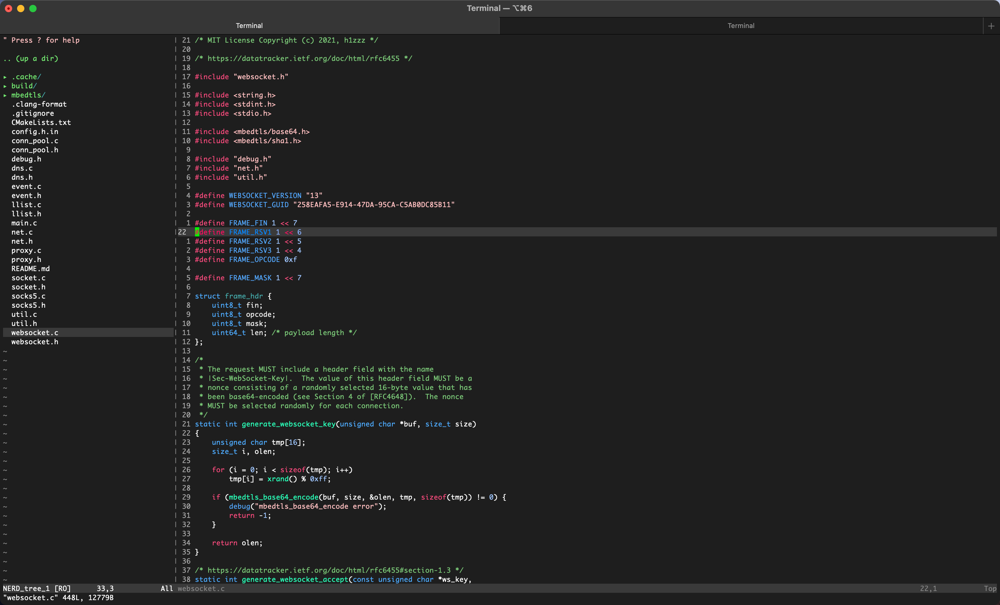

# what.vim

vim theme for 256



**vim-plug**

```vim
call plug#begin('~/.vim/plugged')
Plug 'h1zzz/what.vim'
call plug#end()

colorscheme what
```

refer to https://github.com/sickill/vim-monokai

